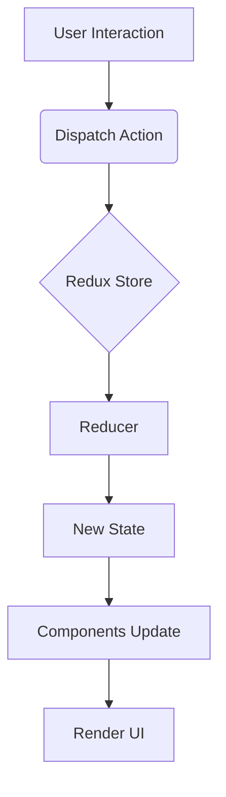

# Architecture

This document outlines the high-level architecture and design principles of the application. The application follows a modern frontend architecture, primarily driven by React's component-based paradigm and Redux for predictable state management.

## 1. Component-Based Architecture

The UI is built as a hierarchy of reusable and modular React components.

-   **Atomic Design Principles**: Components are often designed following principles similar to Atomic Design, starting from small, isolated "atoms" (e.g., buttons, text inputs), combining them into "molecules" (e.g., a form field with a label and input), and then into "organisms" (e.g., a complete login form). These are then assembled into "templates" and finally "pages" (screens).
-   **Separation of Concerns**: Components are designed to have a single responsibility.
    -   **Presentational Components**: Focus solely on how things look. They receive data and callbacks via props and render UI. They typically have no direct dependencies on the Redux store.
    -   **Container Components (Screens)**: Focus on how things work. They connect to the Redux store, fetch data, dispatch actions, and pass data and behavior down to presentational components. Screens are typically found in the `src/screens` directory.

## 2. Data Flow (Unidirectional)

The application adheres to a unidirectional data flow, primarily managed by Redux.

-   **Actions**: Plain JavaScript objects that describe what happened. They are the only way to send data from your application to your Redux store.
-   **Reducers**: Pure functions that take the current state and an action, and return a new state. They specify how the application's state changes in response to actions.
-   **Store**: Holds the entire state tree of your application. It's a single source of truth.
-   **Components**: Dispatch actions to the store and read state from the store.

This pattern makes the application's state changes predictable and easier to debug.

## 3. Folder Structure Conventions

The project's folder structure (detailed in `03-project-structure.md`) is designed to reflect the architectural concerns:

-   `src/components/`: Reusable UI elements (presentational).
-   `src/screens/`: Top-level views (container components).
-   `src/store/`: State management logic (Redux).
-   `src/assets/`: Static resources.
-   `src/test/`: Testing utilities and configurations.

## 4. Styling Approach

**Tailwind CSS** is used for styling the application.

-   **Utility-First CSS**: Tailwind provides a set of low-level utility classes that can be composed to build any design directly in your markup. This approach promotes consistency and speeds up development by eliminating the need to write custom CSS for every component.
-   **Configuration**: Tailwind's configuration is managed via `tailwind.config.cjs`, allowing for customization of design tokens (colors, spacing, fonts, etc.).

## 5. Build Process

**Vite** is used as the build tool.

-   **Fast Development Server**: Vite provides an extremely fast development server with instant hot module replacement (HMR), significantly improving developer experience.
-   **Optimized Builds**: For production, Vite uses Rollup internally to produce highly optimized, minified, and bundled assets.
-   **TypeScript Support**: First-class support for TypeScript out of the box.